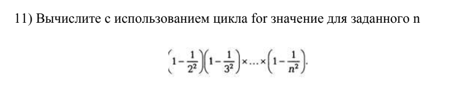
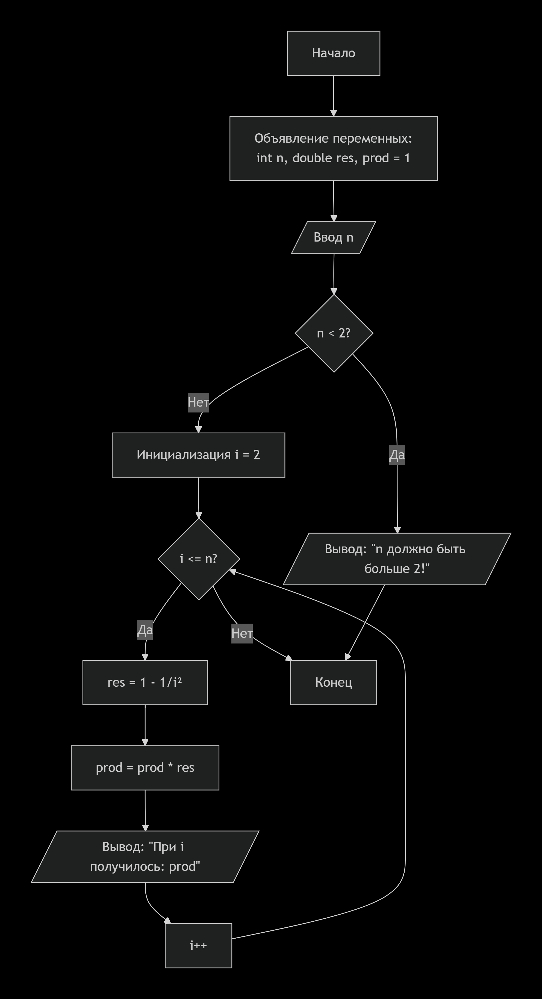
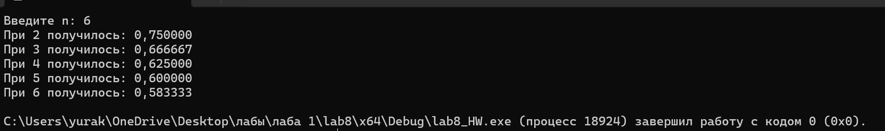

# Домашняя работа к лабораторной работе 8.
## Условия задачи:

## 1. Алгоритм и блок схема:
### Алгоритм:
1. **Начало**
2. Объявить переменные:
 	- `n` — количество шагов
	- `res` — промежуточное вычисление
	- `prod` — промежуточное вычисление
3. Ввод переменных:
   - Ввод переменной: `n`
4. Если `n` < 2:
   - Вывести: n должно быть больше 2!
5. Цикл for `i = 2` до `i <= n`:
   - Вычисление `res` = 1 - 1/`i`^2
   - Вычисление `prod` = `prod` * `res`
7. Вывести результаты расчётов с подстановкой значений в текст.
8. **Конец**

### Блок схема

## 2. Реализация программы:
```
#define _CRT_SECURE_NO_DEPRECATE
#include <stdio.h>
#include <locale.h>
#include <math.h>

int main() {
    setlocale(LC_ALL, "");

    int n;
    double res, prod = 1;

    printf("Введите n:");
    scanf("%d", &n);

    if (n < 2) printf("n должно быть больше 2!");

    for (int i = 2; i <= n; i++) {
        res = 1 - (1 / pow(i, 2));
        prod *= res;
        printf("При %d получилось: %f\n", i, prod);
    }

    return 0;
}
```
## 3. Результат работы программы

## 4. Информация о разработчике
Капичников Юрий, бИПТ-252
